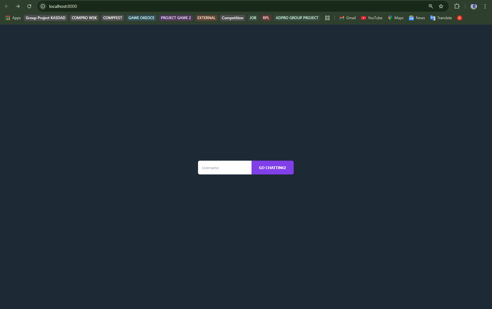
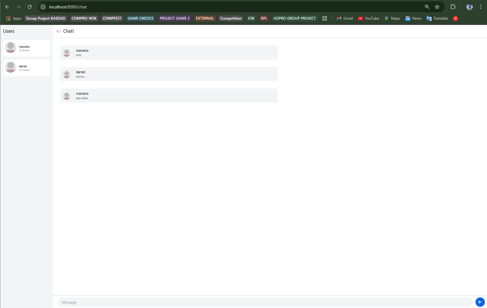
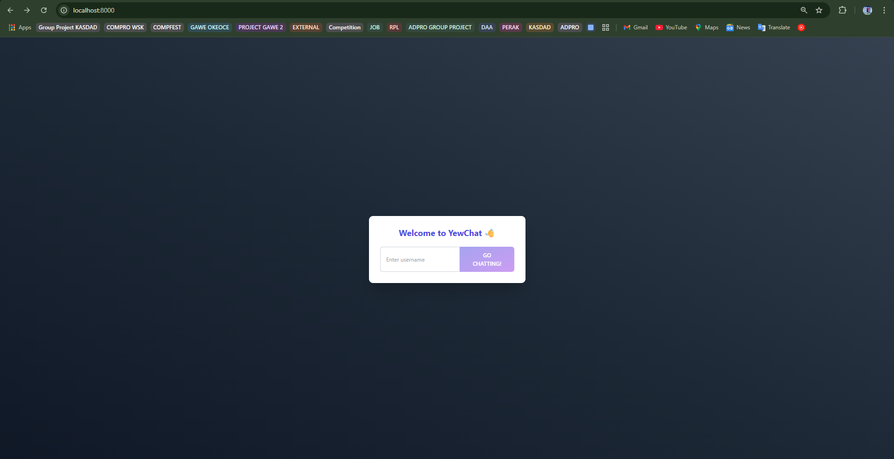
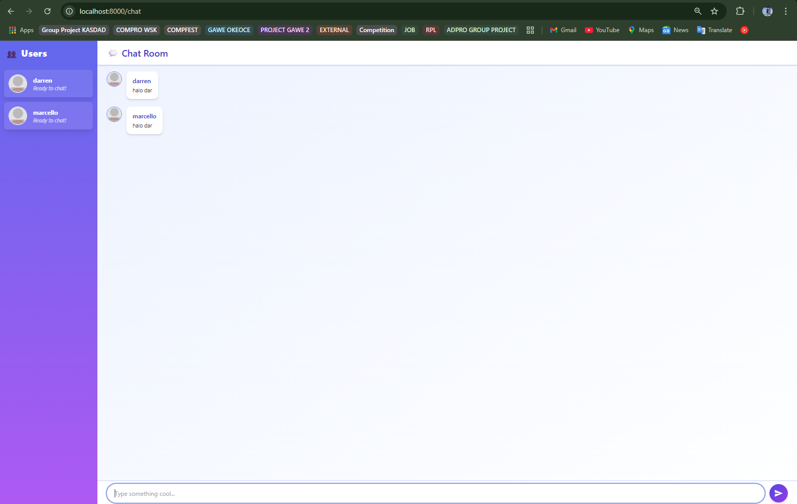

# Advanced Programming Module 10 - Webchat
### Darren Marcello Sidabutar - 2306256293

> Original code

> Be creative!

On the login page, the styling was revamped to create a more modern and engaging look. The background was updated to a dark gradient (bg-gradient-to-tr from-gray-900 via-gray-800 to-gray-700) for a sleek visual feel. The login form was centered both vertically and horizontally using flexbox (flex items-center justify-center) with full viewport height (min-h-screen). The input section was placed inside a white card container with rounded corners and shadow effects (bg-white rounded-xl shadow-2xl) to make it stand out. The input field received padding, a visible border, and a glowing ring effect on focus (focus:ring-2). The submit button was upgraded with a gradient background (from-indigo-600 to-purple-600), hover transitions, and a disabled state style to enhance interactivity.

The chat page was visually upgraded to provide a more user-friendly and vibrant experience. The user sidebar was redesigned with a purple-blue gradient (bg-gradient-to-b from-indigo-500 to-purple-500) and a glassmorphism hover effect (backdrop-blur-md) for a modern aesthetic. User avatars were enhanced with white borders and a hover zoom effect, making the UI feel more interactive. Chat bubbles were restyled with padding, rounded corners, and subtle shadows (bg-white rounded-xl shadow-md) to resemble modern messaging apps. The chat area now includes better spacing between messages and scrollability for long conversations. The message input section features a fully rounded input field with comfortable padding, a glowing focus ring, and a send button styled with gradient colors and shadows for a polished, professional finish.